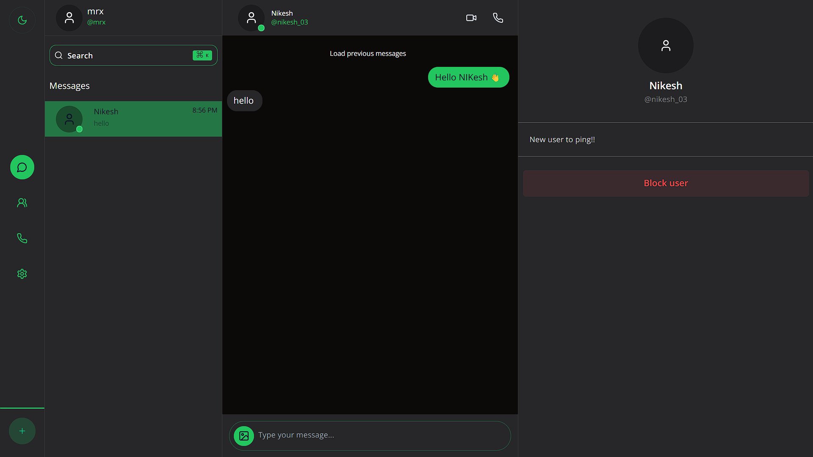
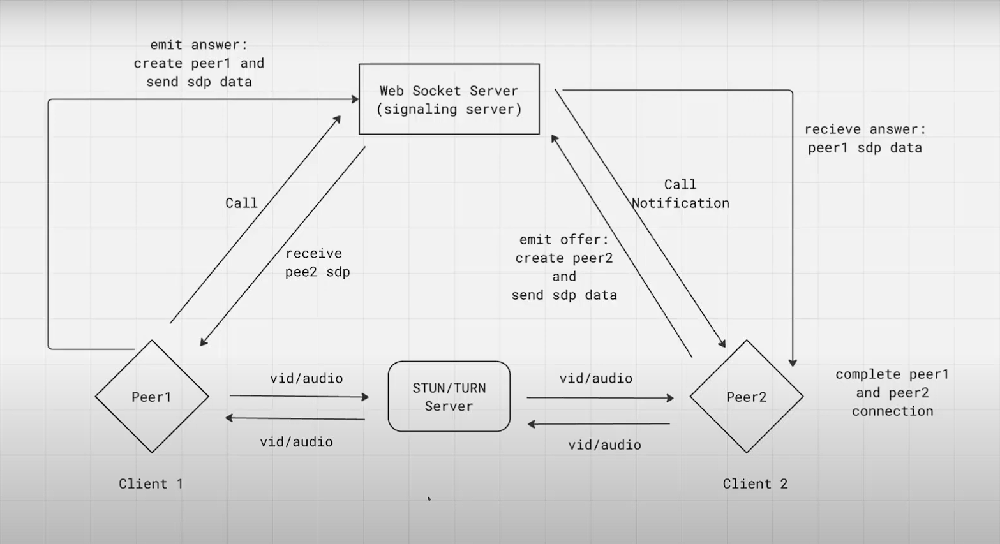

# **PING - A Real-time E2EE Chat Application**  

  

**PING** is a secure and feature-rich chat application offering **end-to-end encrypted (E2EE) private messaging, video calls, voice calls, and group chats**. Built with **Next.js** for both the frontend and backend, it ensures a seamless and modern user experience. Real-time communication is powered by an **Express-based socket server**, delivering fast and reliable messaging.  

  
  
  
  
  

---

## 🔮 **Features**  

- 💬 Real-time messaging with other users  
- 🔒 End-to-end encrypted (E2EE) private messaging  
- 🔍 Advanced search functionality for finding users easily  
- 🎨 Customizable themes  
- 📱 Fully responsive design, accessible on any device  
- 😍 Group chat support  
- 🤖 Privacy settings for user control  
- 👤 User profile management  
- 🔐 Secure authentication and authorization system  

---

## 🚀 **Live Preview**  

🔗 **[Try PING Live](https://ping-messenger.vercel.app/)**  

---

## 💻 **Tech Stack**  

  
  
  
  
  
  
  
  
  
  

---

## ⚙️ **Installation**  

### **1️⃣ Clone the repository:**  

### **2️⃣ Set up environment variables**  

#### **Frontend `.env` (ping-app)**

- `NEXT_PUBLIC_BACKEND_URL=your_backend_url`
- `NEXT_PUBLIC_UPLOADTHING_SECRET=your_secret_key`
- `NEXT_PUBLIC_UPLOADTHING_APP_ID=your_app_id`
- `NEXT_PUBLIC_JWT_SECRET=your_jwt_secret`

#### **Backend `.env` (websocket-server)**

- `DATABASE_URL=your_database_url`
- `PORT=your_backend_port`
- `JWT_SECRET=your_jwt_secret`

### **3️⃣ Install dependencies:**  

Navigate to both `frontend` and `backend` folders and run:

### **4️⃣ Start the development server:**  

### **5️⃣ Access the application:**  

---

## 📡 **WebRTC Flow**  

  

### **1️⃣ Caller (User 1) initiates a call**  
- Gets media stream (`getUserMedia`)  
- Notifies User 2 via WebSocket (`webrtc:incoming-call`)  
- Does NOT create an offer yet (Waits for User 2 to accept)  

### **2️⃣ Receiver (User 2) accepts the call**  
- Initializes `RTCPeerConnection`  
- Creates an offer (`createOffer()`)  
- Sets local description (`setLocalDescription(offer)`)  
- Sends SDP offer to User 1 via WebSocket (`webrtc:offer`)  

### **3️⃣ Caller (User 1) receives the offer**  
- Initializes `RTCPeerConnection`  
- Sets remote description (`setRemoteDescription(offer)`)  
- Creates an answer (`createAnswer()`)  
- Sets local description (`setLocalDescription(answer)`)  
- Sends SDP answer to User 2 via WebSocket (`webrtc:answer`)  

### **4️⃣ Receiver (User 2) receives the answer**  
- Sets remote description (`setRemoteDescription(answer)`)  
- 🎯 Once set, both peers should see each other's video  

### **5️⃣ ICE Candidate Exchange (Handles NAT traversal)**  
- Both peers send their ICE candidates via WebSocket (`webrtc:candidate`)  
- Each peer receives and adds the ICE candidate (`addIceCandidate()`)  

---

## 🌟 **Support Us**  

If you find **PING** helpful, please consider **starring ⭐ the repository**. Your support helps us grow and improve this project!  

---